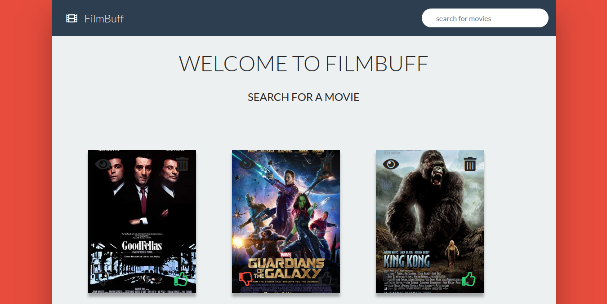
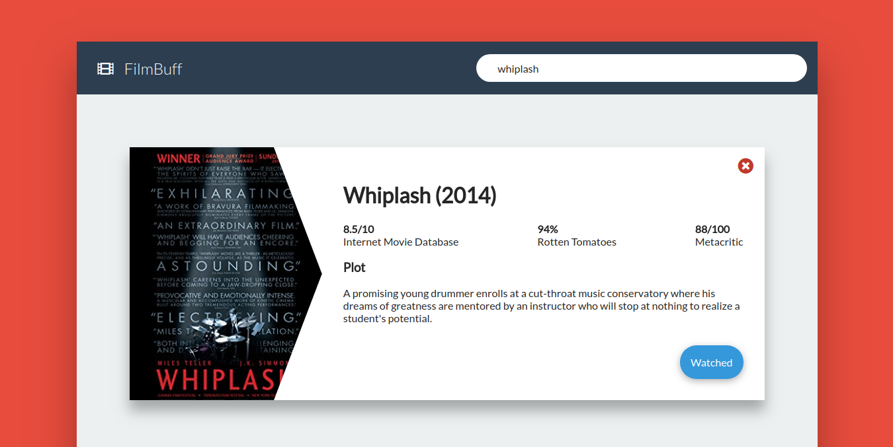
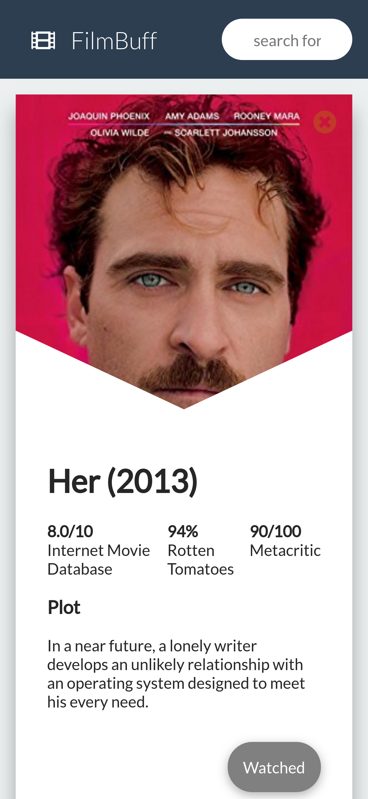

# FilmBuff

A single page app that lets you to search for your favorite movies and add them to a **watched** list.

## Demo
[FilmBuff](https://film-buff-app.netlify.com/)

## Contents
- [Prerequisites](#prerequisites)
- [Installation](#installation)
- [Features](#features)
- [Screenshots](#screenshots)
  - [Watched movies](#watched-movies)
  - [Search](#search)
- [Usage](#usage)
- [License](#license)

## Prerequisites
* [npm](https://www.npmjs.com/get-npm)

## Installation
Clone the app repository and install required packages

```
$ git clone https://github.com/anigopale/film-buff-app
cd film-buff-app
npm install
```

## Features
* movie search
* add/remove movies from *watched* list
* upvote/downvote saved movies
* view saved movies
* persistent app state (saved movies aren't lost on reloads)

## Screenshots

### Watched movies



### Search




## Usage
Run the start script and navigate to ``localhost:3000`` in the browser.
```
$ npm run start
```

## License
[MIT](LICENSE)
